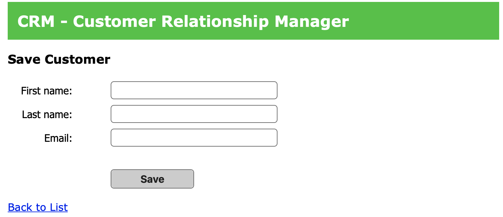

# Create a Customer Tracker Website

This is an academic project. The main idea is to demonstrate how to build a website using Java, Spring MVC, Hibernate, MySQL, TomCat etc.!

## Main features
- Create a user profile
- Update existing user Info
- Delete existing users
- Search users

## Technologies used
- Spring MVC: provide support for web app initialization
- Hibernate: a framework for mapping an object-oriented domain model to MySQL database.
- MySQL: Database
- MySQL WorkBench: a unified visual tool for database architects, developers, and DBAs.
- JSP (JAVA Sever Page): create dynamically generated HTML web pages. 
- TomCat: the web server

## Requirements
- Java
- Hibernate 5
- Spring 5

## Screenshots of the app
- Home Page

- Add Customer Page

- Delete Page

- Update Page

- MySQL Workbench 

